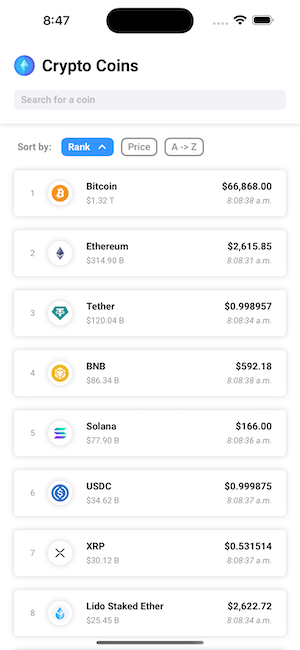
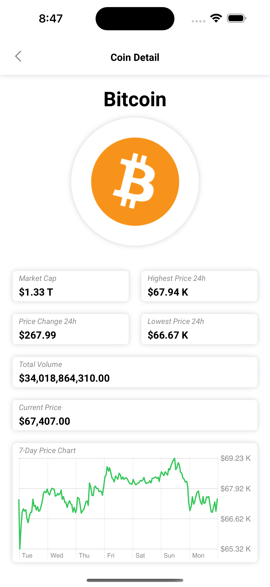
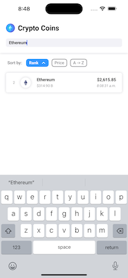

#  Crypto Coins App

An app for browsing the top crypto coins' current market value.

  

## Project Enhancements
For this project, I am adding several features to improve software quality and expand my skills:
- **SwiftLint**: To promote consistent coding standards.
- **MVVM-C**: I have experience with MVVM. This will be my first time using the Coordinator pattern for navigation.
- **Unit Testing**: To ensure functionality of all components.
- **UI Testing**: To verify user interface interactions.
- **Swift Charts**: To display price history data. I have limited experience with this framework.

While I have read about these features, this is my first time researching and applying them in a real project, which will improve the overall quality and maintainability of the app.

## Roadmap
- **Project Setup**: 
  - [x] Set up repository, SwiftLint, and project structure.
  - [x] Implement Coordinator for navigation management.
  
- **Core Functionality**:
  - [x] Build the networking layer to fetch data from CoinGecko.
  - [x] Create the Coin List UI with search functionality.
  - [x] Implement navigation from the list to a detailed coin view.
  
- **Coin Detail View**:
  - [x] Develop the detail view.
  - [x] Integrate Swift Charts to display price history.

- **Testing and Quality**:
  - [x] Write unit tests for all components during development.
  - [x] Ensure coding standards with SwiftLint.
  - [x] Add UI testing.

## Next Steps
- Here is a list of nice-to-have features that I would like to add to the app:
  - [ ] Add a logger.
  - [ ] Tap to load more (pagination).
  - [ ] Add description in detail view.
  - [ ] Add animations.

## Notes 
- **What I Learned**:
  - The focus and purpose of unit testing is to ensure component reliability.
  - The Coordinator pattern helps with separation of concerns, which helps with scalability.
  - UI testing is usefull for catching regression bugs and reduces manual testing.
  
- **Extras Not in Roadmap**:
  - Sort the coin list by different options.
  - Custom swipe-back gesture for navigation.
  - Color theme suitable for both light and dark mode.
  - Empty state for search function.
  - Network error state with a "try again" option when an endpoint fails
  - QA target for testing that uses a mock network service 

- **Decisions During Development**:
  - No external third-party libraries were needed due to the scope of the project. This helps eliminate the need to depend on third-party library compatibility over time. If the scope included user authentication, a third-party library would almost certainly be needed.

## Known Issues 
- Currently, when the endpoint returns a message stating that the request limit has been reached, the `NetworkManager` class prints "Error decoding JSON." It would be better to catch that case and print "request limit reached" in the console.

## Special Mentions
- Here are some of the resources I used during the development of this App, 
- **SwiftLint**: [Simple guide to adding SwiftLint to your Xcode project](https://isnihal.medium.com/simple-guide-to-adding-swiftlint-to-your-xcode-project-11d2ed20da26)
- **Coordinator Pattern**: [Coordinator pattern in SwiftUI](https://www.swiftanytime.com/blog/coordinator-pattern-in-swiftui)
- **Network Layer**: [How to create a network layer for your iOS app](https://sabapathy7.medium.com/how-to-create-a-network-layer-for-your-ios-app-623f99161677)
- **HackingWithSwift**: [HackingWithSwift webside](https://www.hackingwithswift.com)
- **SwiftfulThinking**: [SwiftulThinking youtube link](https://www.youtube.com/@SwiftfulThinking)
- **Font**: [SwiftUI custom fonts](https://codewithchris.com/swiftui-custom-fonts/#:~:text=Setting%20up,-To%20add%20a&text=Choose%20the%20font%20that%20you,and%20check%20Add%20to%20targets.)
- **Icon**: [Ethereum icons created by Freepik - Flaticon](https://www.flaticon.com/free-icons/ethereum)
